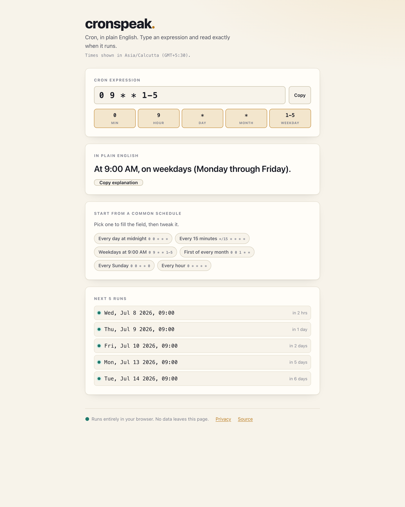

# cronspeak

**Cron, in plain English.**

cronspeak turns a cron expression into a clear sentence, live as you type, and
previews the next five times it will run in your own timezone. It is a single
static page: no accounts, no servers, no tracking, and it works offline once the
page has loaded.



## Why

Cron syntax is terse and easy to get wrong. `0 9 * * 1-5` is not obviously
"weekdays at 9:00 AM" until you have read the field order enough times to hold it
in your head. cronspeak reads it back to you in words and shows the actual
upcoming run times, so you can confirm a schedule does what you meant before you
paste it into a crontab.

## Features

- **Plain-English translation**, updated on every keystroke.
- **Next 5 runs** computed in your local timezone (the timezone is labelled so
  there is no ambiguity).
- **Preset buttons** for common schedules — "Every day at midnight", "Every 15
  minutes", "Weekdays at 9:00 AM", "First of every month", "Every Sunday",
  "Every hour" — that fill the field for you (the English → cron direction).
- **Live validation** with specific, friendly error messages ("99 is out of
  range for minute (allowed 0–59)").
- **Copy to clipboard** for both the cron string and the English explanation.
- **Full 5-field cron support:** stars, lists (`1,2,3`), ranges (`1-5`), steps
  (`*/15`, `1-30/5`), named months (`JAN`–`DEC`) and named days (`SUN`–`SAT`),
  day-of-week `0` and `7` both meaning Sunday, and the macros `@yearly`,
  `@annually`, `@monthly`, `@weekly`, `@daily`, `@midnight`, and `@hourly`.

## How your privacy is protected

cronspeak has nothing to send anywhere, and it is built so that it *cannot* send
anything even by accident. The page ships with a Content Security Policy that
sets `connect-src 'none'`, which tells the browser to **block every network
request the page might try to make** — no analytics, no telemetry, no API calls,
no fonts or scripts pulled from a CDN. Every calculation happens in your browser
on your device. If the app ever remembers your last expression, it stores it in
your browser's own `localStorage` and nowhere else; clearing your site data
removes it.

See [PRIVACY.md](PRIVACY.md) for the full policy and [COMPLIANCE.md](COMPLIANCE.md)
for how the design maps to data-protection expectations.

## Quickstart

Open `index.html` in a browser — that's the whole app. Because it uses ES
modules, some browsers restrict module loading over the `file://` protocol, so
the most reliable local run is a tiny static server:

```bash
python3 -m http.server 8000
# then visit http://localhost:8000
```

Or use the hosted copy: <https://sreenivas-sadhu-prabhakara.github.io/cronspeak/>

## Running the tests

The scheduling logic lives in framework-free, DOM-free ES modules under `src/`
and is covered by Node's built-in test runner (no dependencies to install):

```bash
npm test        # runs: node --test
```

Requires Node 18 or newer (the built-in test runner is unavailable on older
versions).

## Project layout

```
index.html            The page; loads src/app.js as a module.
src/parser.js         Parses and validates a cron expression.
src/explain.js        Turns a parsed expression into an English sentence.
src/schedule.js       Computes the next N runs from a reference date.
src/app.js            The only file that touches the DOM.
src/style.css         Styles (light + dark via prefers-color-scheme).
test/                 node:test suites for parser, explain, and schedule.
```

The pure modules take a reference `Date` for all time math, so the tests are
deterministic; the UI simply passes `new Date()`.

## Contributing

Contributions are welcome — see [CONTRIBUTING.md](CONTRIBUTING.md). Please also
read the [Code of Conduct](CODE_OF_CONDUCT.md). Security reports go through
[SECURITY.md](SECURITY.md).

## License

MIT © 2026 Sreenivas Sadhu — see [LICENSE](LICENSE).
